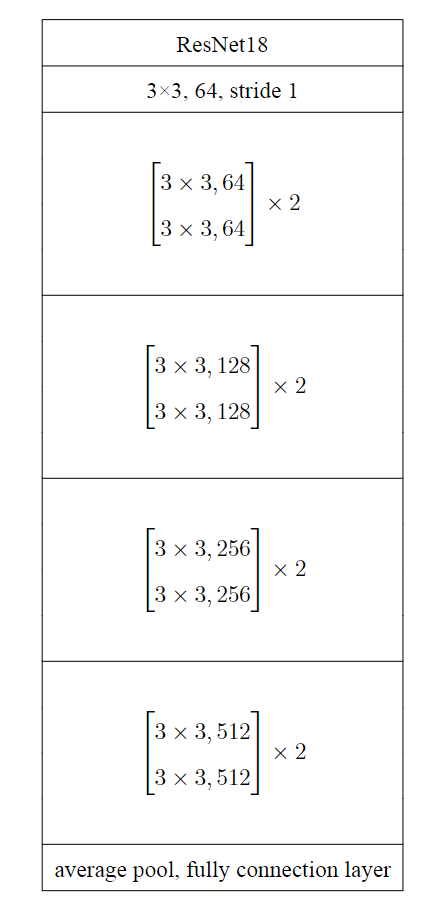

# UltraThemis
UltraThemis is a novel trustworthy speech acquisition with tamper-proof detection. We are the first to probe the acoustic nonlinearity effect that reversely converts audible signals into ultrasonic bands, which has not been explored in the literature, and exploit multiple acoustic effect for ultrasonic sensing. UltraThemis enables a proactive and scalable detection against various tampering methods.

<strong>Doppler Frequency Shift (DFS)</strong> and <strong>Time-Of-Flight (TOF)</strong> are often used to describe the dynamic and static characteristics of vocal tract in ultrasound sensing techniques, which bring the correlation between speech signal and ultrasound. Additionally, we discover a new acoustic nonlinear phenomenon
where audible signals can be modulated onto the ultrasonic spectrum due to microphone nonlinearity. <strong>The acoustic nonlinear (ANL)</strong> characteristic further strengthens the correlation between speech signal and ultrasound. Based on these three ultrasound effects, we propose UltraThemis, a tamper-proof speech acquisition system, which demands neither peripheral nor modification on smartphone-like mobile devices. Ultrasound is transmitted by the build-in speaker and received by the build-in microphone.  In particular, we design a meta learning based method to improve the performance of UltraThemis upon new users without the requirement of registration. This repository includes the code which realizes audio tamper detection based on only DFS or both ANL and DFS, and the result of the system on different mobile phones. We will release our datasets and complete code to facilitate the ultrasonic sensing research after necessary data desensitization according to the requirements of IBR and relevant regulations.  

# Repository structure
### src  
+ This folder contains the source code 
+ MTL: source code which realizes audio tamper detection based on only DFS in case that some smartphones presents no obvious nonlinearity.    
+ two-stream: source code which realizes audio tamper detection based on both DFS and ANL. The basic model used in content-consistency network, homology network and meta-learning is ResNet18.  

### The performance on diverse smartphones.md  
+ This file records the result of our system on different mobile phones, including accuracy, precision and recall.  

# The architecture of ResNet18
The ResNet18 is consist of 17 convolutional layers and 1 fully connected layer. The concrete parameters is shown below. For each row, (N×N, C) means the kernel size is N and the number of output channel is C.

# Installation
Ensure you have:  
+ Python >= 3.7
+ Pytorch 1 with CUDA
+ librosa  

# How to use
Here's my recommendation on what order to run things:

<strong>MTL</strong>(realizes audio tamper detection based on only DFS):

1 - prepare your dataset and alter the parameter in src/config.py

2 - generate noisy audios

> python src/MTL/add_noise.py

3 - generate tampered audios:

> python src/MTL/generate_attack_data.py

4 - train your own model:

> python src/MTL/train_MTL.py

<strong>two-stream</strong>(realizes audio tamper detection based on both DFS and ANL):

1 - prepare your dataset and alter the parameter in src/config.py

2 - train meta-learning model:

> python src/two-stream/train_meta.py

Here are the hyper-parameters that you can setup
+ model_save_path: the path where the model will be saved
+ epoch: the number of epoches the model will be trained
+ n_way: in every task, the samples will consist of data from n_way individuals
+ k_spt: k shot for support set
+ k_qry: k shot for query set
+ batch_size: batch size

3 - train content-consistency network and homology network:

> python src/train.py

Here are the hyper-parameters that you can setup
+ model_save_path: the path where the model will be saved
+ anl_or_dfs: train content-consistency network or homology network, 0 for the former and 1 for the latter
+ epoch: the number of epoches the model will be trained
+ batch_size: batch size
+ learning_rate: learning rate
+ is_reload_model: load pre-trained model or not

4 - test overall performance
> python src/test.py

Here are the hyper-parameters that you can setup
+ batch_size: batch size
+ model_save_path1: the path where the content-consistency network saved
+ model_save_path2: the path where the homology network saved
+ model_save_path3: the path where the meta-learning network saved
+ threshold1: the threshold for content-consistency network
+ threshold2: the threshold for homology network
+ threshold3: the threshold for meta-learning network